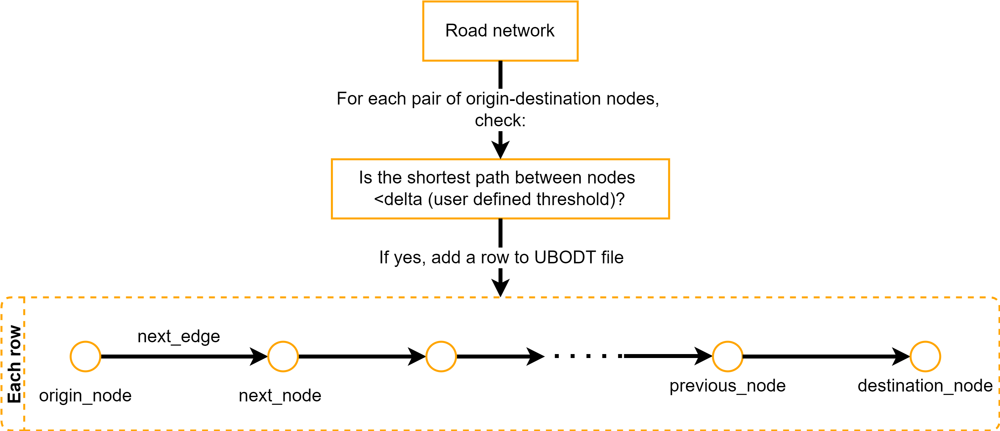

class: top, left

## What is map matching?

--

#### It's the process of matching noisy GPS data to the most probable travel route.

--

```{r title-cover-closeup, echo = FALSE, fig.align = "center", out.width = "80%"}
knitr::include_graphics(here("img", "title-cover-closeup.png"))
```

---

class: top, left

## Who are interested in map matching and why?

--

#### Not surprisingly, anybody who deals with GPS data!

--

- **Auto insurance companies**: Crash risk assessment (e.g., Are drivers often driving through high crash risk roads? Do we need to adjust premiums?)

--

- **Highway agencies**: Streamline winter maintenance efforts (e.g., Are snowplows serving the same route multiple times? Can they be directed somewhere else?)

--

- **Transportation researchers**: Travel pattern analyses (e.g., Do older drivers with cognition and/or vision problem(s) prefer one route over another?)

---

class: top, left

## How can we perform map matching?

.pull-left-30[

```{r map-match-tool-options, echo = FALSE}
tibble(
  option = c(
    "Google Snap to Roads API", "Mapbox Map Matching API", "QGIS Plugin", 
    "Fast Map Matching (FMM)"
  ),
  url = c(
    "https://developers.google.com/maps/documentation/roads/snap",
    "https://docs.mapbox.com/api/navigation/map-matching/",
    "https://github.com/jagodki/Offline-MapMatching",
    "https://fmm-wiki.github.io/"
  )
) %>% 
  mutate(option = cell_spec(option, "html", link = url)) %>%
  select("Four popular options" = option) %>%
  kbl("html", escape = FALSE) %>%
  kable_styling(
    bootstrap_options = c("striped", "hover")
  )
```

]

.pull-right-70[

```{r map-match-tools-matrix, echo = FALSE, fig.align = "center"}
knitr::include_graphics("img/map-match-tools-matrix.png")
```

]

---

class: middle, center

# Hello, FMM!

```{r fmm-logo, echo = FALSE, out.width = "60%"}
knitr::include_graphics(
  "https://raw.githubusercontent.com/fmm-wiki/fmm-wiki.github.io/master/assets/images/fmm.png"
)
```

---

class: top, left

## Meet the fast map matching ([FMM](https://fmm-wiki.github.io/)) tool

```{r fmm-wiki, echo = FALSE}
knitr::include_url("https://fmm-wiki.github.io/", height = "500px")
```

---

class: top, left

## FMM tool overview

```{r fmm-tool-overview, echo = FALSE, fig.align = "center"}

```

---

class: top, left

## Input 1: Road network

.pull-left-30[

#### Fields & definition:

```{r road-network-fields, echo = FALSE}
tibble(
  field = c("id", "source", "target"),
  definition = c(
    "ID of a line",
    "source node ID", 
    "target node ID"
  )
) %>%
  kbl("html")
```

]

.pull-right-70[

```{r road-network-graph, echo = FALSE, fig.align = "center", out.width = "70%"}
knitr::include_graphics("https://fmm-wiki.github.io/assets/images/network.png")
```

]

---

class: top, left

## Input 2: GPS points

.pull-left[

#### Fields & definition:

```{r gps-fields, echo = FALSE}
tibble(
  field = c("id", "x", "y", "timestamp (optional)"),
  definition = c(
    "Trip ID", 
    "GPS longitude", 
    "GPS latitude",
    "Observation timestamp"
  )
) %>%
  kbl("html")
```

#### Additional notes:

- Each row has a single observation
- GPS points must be sorted by trip ID and timestamp
- Use `;` as a delimiter

]

.pull-right[

#### Valid example:

```{verbatim}
id;x;y;timestamp
1;1.65889;0.25098;1
1;1.65494;0.70183;2
1;2.49336;1.76567;3
1;3.54929;1.88827;4
1;4.13064;2.45776;5
2;4.15042;1.60353;2
2;3.47019;0.92330;4
2;2.40635;0.92330;6
2;2.14533;1.53234;8
2;2.08601;2.57641;10
```

]

---

class: top, left

## Input 3: Upper Bounded Origin Destination Table (UBODT) file

.pull-left[

#### Fields & definition:

```{r ubodt-fields, echo = FALSE}
tibble(
  field = c("source", "target", "next_n", "prev_n", "next_e", "distance"),
  definition = c(
    "Source node index", 
    "Target node index", 
    "Index of the node visited after the source node",
    "Index of the previous node visited before the target node",
    "Index of the next edge visited after the source node",
    "Shortest path distance between the source and target nodes"
  )
) %>%
  kbl("html")
```

**Note**: UBODT file is only needed for the `FMM` tool

]

.pull-right[

#### Valid example:

```{verbatim ubodt-example}
source;target;next_n;prev_n;next_e;distance
0;6;4;7;4;3
0;10;4;5;4;3
0;8;4;5;4;3
0;9;4;4;4;2
0;7;4;4;4;2
0;4;4;0;4;1
0;12;4;9;4;3
0;1;1;0;0;1
0;5;4;4;4;2
1;9;0;4;1;3
1;7;0;4;1;3
1;4;0;0;1;2
1;5;0;4;1;3
1;0;0;1;1;1
```

]

---

## UBODT file is computed from the road network

```{r ubodt-row-info, echo = FALSE, fig.align = "center"}

```

---

class: top, left

## Input 4: Config files

.pull-left[

#### UBODT config

```{verbatim ubodt-config-example}
<?xml version="1.0" encoding="utf-8"?>
<config>
  <input>
    <network>
      <file>../data/edges.shp</file>
      <id>id</id>
      <source>source</source>
      <target>target</target>
    </network>
  </input>
  <parameters>
    <delta>3</delta>
  </parameters>
  <output>
    <file>../data/ubodt.txt</file>
  </output>
</config>
```

]

.pull-right[

#### FMM config

```{verbatim fmm-config-example}
<?xml version="1.0" encoding="utf-8"?>
<config>
  <input>
    <ubodt>
      <file>../data/ubodt.txt</file>
    </ubodt>
    <network>
      <file>../data/edges.shp</file>
      <id>id</id>
    </network>
    <gps>
      <file>../data/trips.shp</file>
      <id>id</id>
    </gps>
  </input>
  <parameters>
    <k>4</k>
    <r>0.4</r>
    <gps_error>0.5</gps_error>
  </parameters>
  <output>
    <file>mr.txt</file>
  </output>
</config>
```

]

---

## Output: Map matching result

.pull-left[

```{r fmm-output-fields, echo = FALSE}
tibble(
  field = c(
    "ogeom", "pgeom", "mgeom", "error", "offset", "spdist", "opath", "cpath", 
    "tpath"
  ),
  definition = c(
    "Original trajectory geometry", 
    "A line connecting the matched points", 
    "The geometry of the cpath",
    "Distance from each point to its matched point",
    "Distance from the matched point to the start of the matched edge",
    "Shortest path distances traversed between consecutive points",
    "Edge matched to each point in trajectory",
    "The path traversed by the trajectory",
    "Edges traversed between consecutive points"
  )
) %>%
  kbl("html")
```

]

.pull-right[

```{r fmm-output-graph, echo = FALSE, fig.align = "center"}
knitr::include_graphics("https://fmm-wiki.github.io/assets/images/demo1.png")
```

]

---

class: middle, center

# Intro to GIS basics

---

class: top, left

## GIS file formats

.pull-left[

```{r gis-file-formats-smry-table, echo = FALSE}
tribble(
  ~FORMAT, ~SHAPEFILE, ~GEOJSON, ~GEOPACKAGE,
  "Age (years)", "30", "10", "5",
  "Compatibility", "GIS", "GIS, any text editor", "GIS, SQL",
  "Relative size", "1.00", "2.26", "1.30",
  "Compression ratio", "4.79:1", "12.08:1", "4.53:1",
  "QGIS performance", "Good", "Bad", "Good",
  "Use case", "Old standard", "Web, small data sets", "New standard"
) %>%
  kbl("html")
```

]

.pull-right[

```{r sf-package-website, echo = FALSE}
knitr::include_url("https://r-spatial.github.io/sf/", height = "500px")
```

]

---

class: top, left

## Road network sometimes has topological errors

.pull-left[

```{r topo-error-definition-table, echo = FALSE}
tibble(
  error = c("Dangles", "Switchbacks", "Knots/Loops", "Overshoots", "Undershoots"),
  definition = c(
    "Lines that should be connected are disconnected", 
    "A line has a bend in it", 
    "A line crosses itself or self-overlaps",
    "A line extends past the line it should connect to",
    "A line does not touch the line it should connect to"
  )
) %>%
  kbl("html")
```

]

.pull-right[

```{r topo-errors-viz, echo = FALSE}
knitr::include_graphics(
  "https://cdn.shortpixel.ai/spai/w_620+q_glossy+ret_img+to_webp/https://www.gislounge.com/wp-content/uploads/2011/11/types-digitizing-GIS-errors.png"
)
```

]

---

class: top, left

## Clean topological errors beforehand

.pull-left[

#### GRASS GIS

```{r grass-v-clean-tool-page, echo = FALSE}
knitr::include_url("https://grass.osgeo.org/grass78/manuals/v.clean.html")
```

]

.pull-right[

#### R interface for GRASS

```{r rgrass-pkg-website, echo = FALSE}
knitr::include_url("https://rsbivand.github.io/rgrass/index.html")
```

]

---

class: top, left

## Check this tutorial

```{r spatial-networks-tutorial, echo = FALSE}
knitr::include_url(
  "https://r-spatial.org/r/2019/09/26/spatial-networks.html", height = "500px"
)
```


